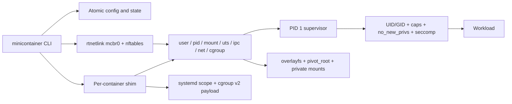

# MiniContainer

[](https://github.com/fullstack-nick/minicontainer/actions/workflows/ci.yml)
[](https://github.com/fullstack-nick/minicontainer/actions/workflows/codeql.yml)

MiniContainer is a daemonless Linux container runtime written in C17. It builds a container
from kernel primitives—namespaces, cgroup v2, overlayfs, pidfds, rtnetlink, nftables, Linux
capabilities, and seccomp—without delegating execution to Docker, containerd, or runc.

It is deliberately small enough to audit and complete enough to demonstrate the hard parts
of a real runtime: durable lifecycle state, crash recovery, resource accounting, bridge
networking, TCP/UDP publication, restrictive security defaults, package upgrades, boot
reconciliation, and reproducible cloud proof.

## What it proves

- Seven Linux namespaces with subordinate UID/GID mapping and PID-1 supervision.
- Digest-addressed Alpine rootfs import, writable overlay layers, `pivot_root`, private
  proc/dev/tmpfs mounts, read-only root, and safe bind/tmpfs options.
- Cgroup-v2 memory, swap, CPU, and PID limits with live stats and OOM accounting.
- Durable `create`, `start`, `run`, `ps`, `inspect`, `exec`, `stop`, `kill`, `logs`, `rm`,
  `gc`, and `stats` behavior with pidfd/start-time identity and atomic state writes.
- Raw rtnetlink bridge/veth/IPAM plus nftables masquerade and declared TCP/UDP ports.
- Empty-by-default capabilities, locked securebits, `no_new_privs`, a default-deny seccomp
  allowlist, restrictive custom profiles, and FD closure before workload exec.
- Rotating logs, two-pass boot reconciliation, exact Debian packaging, SBOM/checksums, and
  deterministic cleanup after crashes, OOMs, races, stress, and reboot.

## Architecture



The CLI is not a daemon. A small root-owned shim holds the container lifecycle and control
socket, while the actual workload runs as PID 2 behind an init supervisor. See
[the architecture guide](docs/architecture.md) and
[syscall walkthrough](docs/syscall-walkthrough.md).

## Build on Ubuntu 24.04

```bash
sudo apt-get install build-essential clang cmake ninja-build pkg-config \
  libarchive-dev libssl-dev libsystemd-dev libjson-c-dev libseccomp-dev nftables
cmake --preset dev-gcc
cmake --build --preset dev-gcc
ctest --preset dev-gcc
```

Privileged runtime tests require cgroup v2, systemd, overlayfs, unprivileged user namespaces,
and configured subordinate IDs for the `minicontainer` account. `minicontainer info --json`
reports prerequisite readiness.

## Quick demo

```bash
sudo minicontainer image import alpine alpine-minirootfs-3.24.1-x86_64.tar.gz

sudo minicontainer run --image alpine --hostname demo -- \
  /bin/sh -c 'echo "hello from $(hostname), pid $$"'

sudo minicontainer run --detach --name web --image alpine \
  --publish 127.0.0.1:8080:8080/tcp -- /app/server

sudo minicontainer ps
sudo minicontainer stats --no-stream --json web
sudo minicontainer exec web -- /bin/sh
sudo minicontainer logs --tail 100 web
sudo minicontainer rm --force web
```

Useful isolation controls:

```bash
sudo minicontainer run --read-only --tmpfs /scratch:64m \
  --cap-add NET_BIND_SERVICE --network none --image alpine -- COMMAND

sudo minicontainer run --bind /allowlisted/source:/data:ro \
  --seccomp-profile /root/restrictive-profile.json --image alpine -- COMMAND
```

Bind sources must be covered by `/etc/minicontainer/config.json`. A custom seccomp profile
is version-1 JSON with a `deny` array; it can only narrow the built-in policy.

## Security model

MiniContainer is a same-kernel isolation runtime, not a virtual machine. It is appropriate
for learning, demos, and controlled workloads; it is not presented as a hostile multi-tenant
sandbox. The [security policy and threat model](SECURITY.md) define trusted components,
enforced controls, residual risks, and private disclosure.

## Verification

The repository contains reproducible evidence for local compilers, sanitizers, Valgrind,
static analysis, privileged integration, CodeQL, exact-artifact GCP deployment, networking,
security, stress, package rollback, reboot recovery, and resource cleanup under
[`docs/proofs`](docs/proofs).

Release artifacts are built once by `scripts/build-release.sh`:

- Debian runtime package;
- detached debug-symbol package;
- SHA-256 files;
- SPDX JSON SBOM;
- build manifest with the embedded Git commit.

Deployment uses a private GCP VM with no external IP. SSH, SCP, and the HTTP demo traverse
authenticated IAP. Final cloud inventory is one running `e2-micro`; temporary NAT and
benchmark capacity are removed before release completion.

## More

- [Architecture guide](docs/architecture.md)
- [Runtime syscall walkthrough](docs/syscall-walkthrough.md)
- [Comparison and scope](docs/comparison.md)
- [Operator runbooks](docs/runbooks)
- [Resume bullet](docs/resume-bullet.md)
- [Contributing](CONTRIBUTING.md)
- [License](LICENSE)
