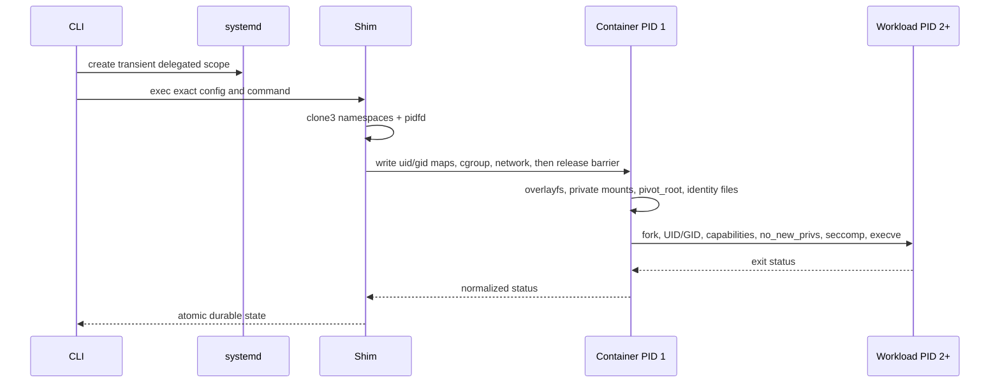

# Architecture

MiniContainer has three process roles: a short-lived CLI, one root-owned shim per running
container, and an init supervisor inside the namespaces. There is no resident daemon.

## State and ownership

Every mutation holds a global registry `flock` and a per-container lock. JSON changes use a
temporary file, `fsync`, atomic `rename`, and directory `fsync`. Runtime identity combines
pidfds, `/proc` start times, namespace inodes, full container IDs, and ownership comments.

The runtime owns only its per-container systemd payload cgroup, `mch*`/`mcc*` veth pair,
full-ID nftables rules, overlay upper/work directories, runtime socket, and logs. Cleanup is
inverse-ordered and reconciliation is safe to repeat.

## Filesystem and security

Images are extracted with libarchive secure flags into digest-addressed immutable roots.
Each container receives a shifted-ID overlay. Bind sources are operator allowlisted and
canonicalized; targets are created beneath the merged root through `openat2` with beneath,
no-magic-link, and no-symlink resolution. The workload then loses undeclared capabilities,
locks securebits, sets `no_new_privs`, loads seccomp, closes inherited FDs, and execs.

## Network

Raw rtnetlink creates `mcbr0`, veths, addresses, routes, and namespace loopback. Serialized
first-fit IPAM assigns `10.44.0.2–254`. An owned `inet minicontainer` nftables table supplies
default-deny forwarding, established return traffic, egress masquerade, hairpin behavior,
and full-ID TCP/UDP DNAT rules.
